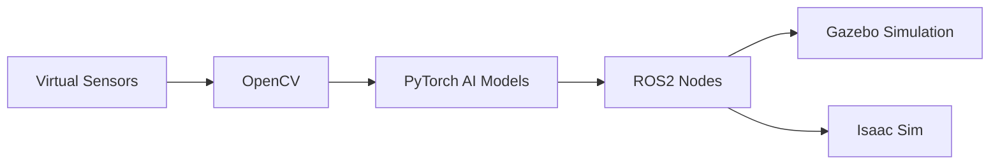

<h1 align="center"> The Ultimate Robotics Simulation Guide</h1>

Building intelligent autonomous robotics simulations using ROS 2, Gazebo, NVIDIA Isaac Sim, CUDA, and PyTorch.

---

## Vision

This repository documents my journey toward mastering modern robotics simulation and artificial intelligence systems. It is part of a broader learning ecosystem designed to cover theoretical foundations, practical AI integration, and essential cybersecurity aspects for robotics.

---

## The Robotics Learning Ecosystem

This guide is one component of a comprehensive learning journey. To provide a holistic understanding of robotics, AI, and cybersecurity, this ecosystem integrates several specialized repositories:

### 1. Robotics Simulation Guide (Current Repository)

This repository (`Robotics_Workspace_Guide`) focuses on the practical aspects of building and testing autonomous robotics systems entirely in simulation. It covers the setup of development environments, ROS 2 programming, Gazebo, NVIDIA Isaac Sim, and GPU acceleration.

*   **Lien :** [1st-adambenjabbar/Robotics_Workspace_Guide](https://github.com/1st-adambenjabbar/Robotics_Workspace_Guide)

### 2. Robotics Courses (Theoretical Foundations)

This repository (`ROBOTICS_COURSES`) delves into the theoretical underpinnings of how robots think and move. It covers behavior (state machines), control systems (PID, State-Space), signal processing, embedded systems, and robotics mathematics, all within the context of ROS 2 and Gazebo simulation.

*   **Lien :** [1st-adambenjabbar/ROBOTICS_COURSES](https://github.com/1st-adambenjabbar/ROBOTICS_COURSES)

### 3. Embedded AI Learning (AI Integration)

Dedicated to building real-world AI systems that run efficiently on edge devices, this repository (`Embedded-AI-Learning`) explores AI foundations, deep learning (CNNs, RNNs, Transformers), modern AI concepts (LLMs), and edge AI (TinyML, model optimization). It includes practical projects like spam classifiers and image recognition models.

*   **Lien :** [1st-adambenjabbar/Embedded-AI-Learning](https://github.com/1st-adambenjabbar/Embedded-AI-Learning)

### 4. Embedded Cybersecurity (Security Aspects)

This repository (`Embedded-Cybersecurity`) focuses on securing robotics, IoT, and embedded systems against real-world cyber threats. It covers network security, robotics attack surfaces, IoT protocol security, embedded firmware protection, and includes labs for attack and defense scenarios.

*   **Lien :** [1st-adambenjabbar/Embedded-Cybersecurity](https://github.com/1st-adambenjabbar/Embedded-Cybersecurity)

---
## *About this guide, it took me days to write, structure, and organize in the right order so the instructions are easier to follow. I created it based on the personal difficulties I had months ago when trying to understand the tools and concepts myself.*
## *For the code examples, they were generated by Claude, but the explanations and the overall structure were written by me.*
## *As for the design languages section, both the writing and explanations were done by Claude, not me, because I honestly do not fully understand that part yet.*
---

# Main Technologies

| Technology | Purpose |
|---|---|
| ROS 2 | Robotics middleware and communication |
| Gazebo | Robotics simulation |
| NVIDIA Isaac Sim | Advanced robotics simulation |
| CUDA | GPU acceleration |
| PyTorch | Artificial intelligence and deep learning |
| OpenCV | Computer vision |
| Docker | Development environments |
| Linux | Robotics operating environment |

---

#  Simulation Architecture

---

#  Complete Robotics Simulation Learning Path

This repository follows a structured roadmap designed to take users from Linux setup to advanced robotics simulation systems.

---

#  Phase 1 — Linux Environment :

##  WSL Installation

### [WSL Installation](./WSL%20Installation.md)

Set up a Linux development environment using Windows Subsystem for Linux.

**Sub-project:** [WSL Setup Check](./projects/01_wsl_setup/README.md)

Topics included:

- Ubuntu installation
- Linux terminal basics
- Development environment preparation
- Windows/Linux integration

---

#  Phase 2 — ROS2 Foundations :

##  ROS2 Installation and Concepts

### [ROS 2 Installation Guide and Concepts Explanation](./ROS%202%20Installation%20Guide.md)

Install ROS 2 and understand the fundamental concepts behind modern robotics middleware.

**Sub-project:** [ROS 2 Environment Check](./projects/02_ros2_basics/README.md)

Topics included:

- ROS2 installation
- Workspaces
- Nodes
- Topics
- Publishers & Subscribers
- Services
- Actions
- Packages
- Communication systems
- Robotics architecture concepts

---

##  Programming With ROS2 :

### [Programming With ROS2](./Programming%20With%20ROS2.md)

Learn how to create robotics applications and systems using ROS2 programming workflows.

**Sub-project:** [Simple ROS 2 Node](./projects/03_ros2_programming/README.md)

Topics included:

- Python ROS2 nodes
- Publishers and subscribers
- Services
- Launch files
- Workspace organization
- ROS2 commands
- Robotics development workflows

---

#  Phase 3 — Robotics Simulation :

##  Gazebo Simulation

### [Gazebo Simulation Coding Guide](./Gazebo%20simulation%20coding%20guide.md)

Build and test autonomous robotics systems inside realistic simulation environments.

**Sub-project:** [Gazebo Launch Template](./projects/04_gazebo_sim/README.md)

Topics included:

- Gazebo installation
- Simulation environments
- Robot spawning
- ROS2 integration
- Sensor simulation
- Robot movement
- Autonomous simulation systems

---

#  Phase 4 — GPU Acceleration :

##  CUDA Installation

### [Cuda Installation](./Cuda%20Installation.md)

Enable NVIDIA GPU acceleration for robotics simulations and artificial intelligence workloads.

**Sub-project:** [CUDA & PyTorch Verification](./projects/05_cuda_test/README.md)

Topics included:

- CUDA installation
- NVIDIA drivers
- GPU acceleration
- AI optimization
- CUDA verification

---

#  Phase 5 — Advanced Robotics Simulation :

##  NVIDIA Isaac Sim

### [Isaac Sim Installation and Use](./isaac%20sim%20Installation%20and%20Use.md)

Integrate ROS2 with NVIDIA Isaac Sim for advanced AI-powered robotics simulation systems.

**Sub-project:** [Isaac Sim ROS 2 Bridge Test](./projects/06_isaac_sim_test/README.md)

Topics included:

- Isaac Sim installation
- ROS2 bridge
- Advanced simulation
- Synthetic data
- Virtual sensors
- Robotics testing
- AI simulation environments

---

#  Phase 6 — Development Workflow :

##  Docker & Git

### [Docker & Git Setup](./Docker%20-%20Git.md)

Set up professional robotics development workflows and containerized environments.

**Sub-project:** [ROS 2 Dockerfile](./projects/07_docker_workflow/README.md)

Topics included:

- Git setup
- GitHub workflows
- Docker containers
- Development environments
- Project management

---

# Phase 7 — Final Integration

## Integrated Autonomous Robotics Ecosystem

### [Final Integrated Project](./projects/final_integrated_project/README.md)

The final step of this guide brings all the components together into a single unified robotics ecosystem.

**Key Features:**
- Full system orchestration
- AI-driven decision making
- High-fidelity simulation integration
- Professional development containerization

---

# Utilities

##  Linux Commands Cheat Sheet :

### [Linux Commands Cheat Sheet](./Linux%20Commands%20Cheat%20Sheet.md)

Useful Linux commands commonly used in robotics and development environments.

---

#  Learning Progression :
##  Foundations

- [x] Linux Fundamentals
- [x] Git & GitHub
- [x] ROS2 Installation
- [x] ROS2 Core Concepts
- [x] Python Fundamentals

---

##  Current Focus :

- [ ] Gazebo Simulation
- [ ] CUDA Integration
- [ ] Isaac Sim Workflows
- [ ] Computer Vision Systems
- [ ] AI Robotics Pipelines
- [ ] Autonomous Navigation

---

##  Future Goals :

- [ ] Smart city simulations
- [ ] Autonomous driving systems
- [ ] Reinforcement learning environments
- [ ] Multi-agent robotics systems
- [ ] AI-powered simulations
- [ ] Large-scale robotics ecosystems

---

#  Simulation Objectives

The project focuses entirely on virtual robotics systems including:

- Autonomous navigation
- AI perception systems
- Environmental mapping
- Sensor simulation
- Traffic simulation
- Reinforcement learning
- Digital environments
- Real-time robotics testing

---

#  GPU Acceleration

CUDA acceleration enables:

- Faster AI inference
- Real-time simulation
- Deep learning workloads
- Computer vision acceleration
- Large-scale simulation environments

---

#  Final Objective

Create a complete autonomous robotics simulation ecosystem capable of:

- Environmental perception
- AI-based decision making
- Autonomous navigation
- Real-time robotics simulation
- Sensor fusion
- Intelligent robotic behavior
- Large-scale virtual testing

without requiring physical robotic hardware.

---

#  Philosophy

> “Simulation is where robotics, artificial intelligence, and engineering converge.”

---

#  Repository Goals

This repository is designed to:

- Document the complete learning journey
- Build professional robotics engineering skills
- Explore modern AI technologies
- Create realistic robotics simulations
- Help robotics learners and developers

---

#  Long-Term Mission

Combining robotics simulation, artificial intelligence, GPU acceleration, and autonomous systems into one unified engineering ecosystem.
---

Building Intelligent Robotics Through Simulation 

BY ADAM BENJABBAR

