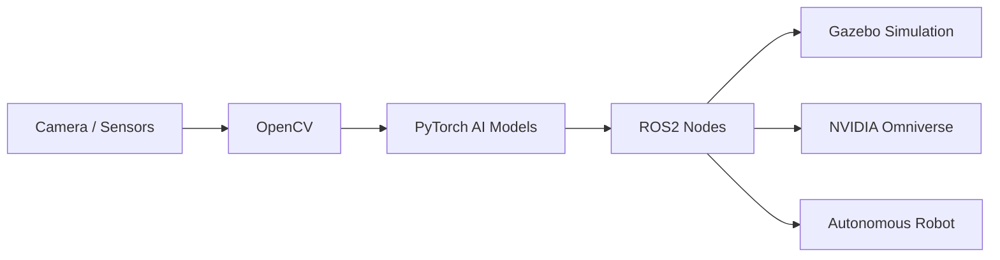

<h1 align="center">🚀 Autonomous Robotics & AI Engineering Stack</h1>

<p align="center">
Building intelligent robotic systems using ROS 2, Gazebo, NVIDIA Omniverse, CUDA, and PyTorch.
</p>

<p align="center">
🤖 Robotics • 🧠 Artificial Intelligence • 🌍 Simulation • ⚡ GPU Acceleration • 🚗 Autonomous Systems
</p>

---

<p align="center">


</p>

---

# 🔮 Vision

This repository documents my journey toward building a complete autonomous robotics ecosystem by combining:

- ROS 2
- NVIDIA CUDA
- PyTorch
- Gazebo
- NVIDIA Omniverse
- Computer Vision
- AI-based robotics systems

The objective is to master the modern robotics and AI stack used in advanced research and industry environments.

---

# 🧠 Tech Stack

| Technology | Purpose |
|---|---|
| ROS 2 | Robotics middleware and communication |
| Gazebo | Robotics simulation |
| NVIDIA Omniverse | Advanced simulation and digital twins |
| CUDA | GPU acceleration |
| PyTorch | Deep learning and AI |
| OpenCV | Computer vision |
| Docker | Containerization |
| Linux | Robotics development environment |

---

# 🏗️ System Architecture



---

# 📚 Documentation & Guides

This repository contains complete installation pipelines, engineering workflows, and robotics learning resources.

---

## 📦 Setup & Installation Guides

### 🐧 Linux & Environment Setup

- [WSL Installation](./WSL%20Installation.md)  
  Setting up Windows Subsystem for Linux for development environments running Windows.

- [Docker & Git Setup](./Docker%20-%20Git.md)  
  Configuring Git and Docker for development and containerization.

---

### ⚡ GPU & AI Setup

- [CUDA Installation](./Cuda%20Installation.md)  
  Enabling NVIDIA GPU acceleration for AI and robotics workloads.

---

### 🤖 Robotics Stack

- [ROS 2 Installation Guide and Concepts](./ROS%202%20Installation%20Guide%20and%20Concepts%20Explanation.md)  
  Installing ROS 2 and understanding its core concepts.

- [Programming With ROS2](./Programming%20With%20ROS2.md)  
  Learning ROS 2 programming fundamentals and workflows.

---

### 🌍 Simulation & Visualization

- [Gazebo Installation and Use](./Gazebo%20Installation%20and%20Use.md)  
  Setting up the Gazebo robotics simulation environment.

- [Omniverse Installation and Use](./Omniverse%20Installation%20and%20Use.md)  
  Installing and configuring NVIDIA Omniverse tools.

---

### 🛠️ Utilities

- [Linux Commands Cheat Sheet](./Linux%20Commands%20Cheat%20Sheet.md)  
  Common Linux commands useful for robotics and development.

---

# 🛣️ Learning Roadmap

## ✅ Completed

- [x] Linux Fundamentals
- [x] Git & GitHub
- [x] Docker Basics
- [x] CUDA Installation
- [x] ROS 2 Installation
- [x] ROS 2 Core Concepts

---

## 🚧 In Progress

- [ ] ROS 2 Advanced Nodes
- [ ] Gazebo Simulation
- [ ] Omniverse Integration
- [ ] Computer Vision Pipelines
- [ ] AI-Based Robotics
- [ ] SLAM & Navigation
- [ ] Autonomous Decision Systems

---

## 🔥 Future Objectives

- [ ] Realistic urban simulation environments
- [ ] Reinforcement learning integration
- [ ] Autonomous vehicle simulation
- [ ] Multi-robot communication systems
- [ ] Real-world robotic deployment
- [ ] Digital Twin systems

---

# 💻 Example ROS2 Workflow

```bash
# Source ROS2
source /opt/ros/humble/setup.bash

# Create Workspace
mkdir -p ~/ros2_ws/src

# Build Workspace
cd ~/ros2_ws
colcon build

# Source Workspace
source install/setup.bash

# Launch Simulation
ros2 launch my_robot simulation.launch.py
```

---

# 🌌 Simulation Goals

The project aims to create increasingly realistic robotics environments including:

- Traffic systems
- Weather conditions
- Sensor simulations
- AI perception systems
- Environmental mapping
- Real-time decision making

---

# ⚡ GPU Acceleration

CUDA and GPU acceleration are integrated to enable:

- Faster AI inference
- Real-time perception
- Deep learning workloads
- Simulation optimization
- Computer vision processing

---

# 🤖 Final Objective

Create a fully autonomous robotics system capable of:

- Environmental perception
- AI-based decision making
- Navigation and mapping
- Real-time simulation
- Sensor fusion
- Digital twin integration
- Deployment on physical robotic hardware

---

# 📈 Future Expansion

Future development may include:

- Autonomous robotic vehicles
- Smart factory robotics
- AI-powered drones
- Industrial automation systems
- Multi-agent robotic systems
- Reinforcement learning environments

---

# 🌍 Philosophy

> “The future belongs to intelligent autonomous systems capable of perceiving, learning, and interacting with the physical world.”

---

# ⭐ Repository Goals

This repository is designed to:

- Document the entire engineering journey
- Help other robotics learners
- Build a professional robotics portfolio
- Explore cutting-edge AI technologies
- Develop real-world engineering skills

---

# 🚀 Long-Term Mission

Combining simulation, artificial intelligence, robotics, GPU acceleration, and autonomous systems into one cohesive engineering ecosystem.

---

<p align="center">
⚡ Building the Future of Intelligent Robotics ⚡
</p>
