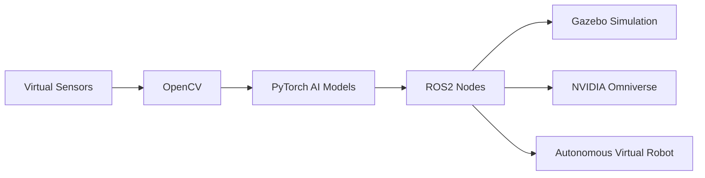

<h1 align="center">🚀 Autonomous Robotics & AI Simulation Stack</h1>

<p align="center">
Building intelligent virtual robotic systems using ROS 2, Gazebo, NVIDIA Omniverse, CUDA, and PyTorch.
</p>

<p align="center">
🤖 Robotics • 🧠 Artificial Intelligence • 🌍 Simulation • ⚡ GPU Acceleration • 🚗 Autonomous Systems
</p>

---

<p align="center">


</p>

---

# 🔮 Vision

This repository documents my journey toward building advanced autonomous robotics simulations by combining:

- ROS 2
- NVIDIA CUDA
- PyTorch
- Gazebo
- NVIDIA Omniverse
- Computer Vision
- AI-based robotic systems

The goal is to create realistic virtual robotics environments entirely in simulation while mastering modern robotics and AI technologies used in industry and research.

---

# 🧠 Tech Stack

| Technology | Purpose |
|---|---|
| ROS 2 | Robotics middleware and communication |
| Gazebo | Robotics simulation |
| NVIDIA Omniverse | Digital twins and advanced simulation |
| CUDA | GPU acceleration |
| PyTorch | Deep learning and AI |
| OpenCV | Computer vision |
| Docker | Containerization |
| Linux | Development environment |

---

# 🏗️ Simulation Architecture



---

# 📚 Complete Robotics Simulation Learning Path

This repository follows a structured roadmap designed to take you from a fresh Linux environment to advanced autonomous robotics simulation systems.

---

# 🐧 Phase 1 — Linux Environment

### [WSL Installation](./WSL%20Installation.md)

Set up a Linux development environment using Windows Subsystem for Linux.

---

# 🤖 Phase 2 — ROS2 Foundations

### [ROS 2 Installation Guide and Concepts](./ROS%202%20Installation%20Guide%20and%20Concepts%20Explanation.md)

Install ROS 2 and learn the core concepts behind modern robotics middleware.

### [Programming With ROS2](./Programming%20With%20ROS2.md)

Learn ROS2 nodes, topics, publishers, subscribers, services, and robotics workflows.

---

# 🌍 Phase 3 — Robotics Simulation

### [Gazebo Installation and Use](./Gazebo%20simulation%20coding%20guide.md)

Build and test autonomous robotics systems inside realistic virtual environments.

---

# ⚡ Phase 4 — GPU Acceleration & AI

### [CUDA Installation](./Cuda%20Installation.md)

Enable NVIDIA GPU acceleration for deep learning and robotics simulation workloads.

---

# 🌌 Phase 5 — Advanced Simulation & Digital Twins

### [Isaac Sim Installation and Use](./isaac%20sim%20Installation%20and%20Use.md)

Integrate ROS2 with NVIDIA Isaac Sim and Omniverse for advanced AI-powered robotics simulations.

---

# 🛠️ Phase 6 — Development Workflow

### [Docker & Git Setup](./Docker%20-%20Git.md)

Set up professional development and containerization workflows.

---

# 📖 Utilities

### [Linux Commands Cheat Sheet](./Linux%20Commands%20Cheat%20Sheet.md)

Useful Linux commands commonly used in robotics and development environments.

---

# 🛣️ Learning Roadmap

## ✅ Completed

- [x] Linux Fundamentals
- [x] Git & GitHub
- [x] Docker Basics
- [x] CUDA Installation
- [x] ROS 2 Installation
- [x] ROS 2 Core Concepts

---

## 🚧 In Progress

- [ ] ROS 2 Advanced Nodes
- [ ] Gazebo Simulation
- [ ] Omniverse Integration
- [ ] Computer Vision Pipelines
- [ ] AI-Based Robotics
- [ ] SLAM & Navigation
- [ ] Autonomous Decision Systems

---

## 🔥 Future Objectives

- [ ] Realistic city simulations
- [ ] Reinforcement learning environments
- [ ] Autonomous driving simulations
- [ ] Multi-robot systems
- [ ] Advanced AI perception
- [ ] Digital twin ecosystems

---

# 💻 Example ROS2 Workflow

```bash
# Source ROS2
source /opt/ros/humble/setup.bash

# Create Workspace
mkdir -p ~/ros2_ws/src

# Build Workspace
cd ~/ros2_ws
colcon build

# Source Workspace
source install/setup.bash

# Launch Simulation
ros2 launch my_robot simulation.launch.py
```

---

# 🌌 Simulation Goals

The project focuses entirely on virtual robotics and simulation systems including:

- Autonomous navigation
- AI perception
- Environmental mapping
- Traffic simulations
- Weather simulations
- Virtual sensor systems
- Reinforcement learning environments
- Digital twins

---

# ⚡ GPU Acceleration

CUDA and GPU acceleration are integrated to enable:

- Faster AI inference
- Real-time simulation
- Deep learning workloads
- Computer vision acceleration
- Large-scale virtual environments

---

# 🤖 Final Objective

Create a fully simulated autonomous robotics ecosystem capable of:

- Environmental perception
- AI-based decision making
- Autonomous navigation
- Real-time simulation
- Sensor fusion
- Digital twin integration
- Large-scale virtual testing

without requiring physical robotic hardware.

---

# 📈 Future Expansion

Future development may include:

- AI-powered virtual vehicles
- Smart city simulations
- Autonomous drone simulations
- Industrial automation simulations
- Multi-agent AI systems
- Reinforcement learning platforms

---

# 🌍 Philosophy

> “Simulation is the bridge between artificial intelligence and real-world innovation.”

---

# ⭐ Repository Goals

This repository is designed to:

- Document the entire learning journey
- Build advanced robotics engineering skills
- Explore cutting-edge AI technologies
- Create realistic robotics simulations
- Develop professional-level engineering workflows

---

# 🚀 Long-Term Mission

Combining simulation, artificial intelligence, robotics, GPU acceleration, and autonomous systems into one unified virtual engineering ecosystem.

---

<p align="center">
⚡ Building Intelligent Robotics Through Simulation ⚡
</p>
