#  ROS2 Humble Installation Guide (Ubuntu 22.04)

> Full installation tutorial for **ROS2 Humble Hawksbill** on **Ubuntu Jammy (22.04)**
> Written with **0 knowledge of Linux** required — every command and abbreviation is explained in **Bash** 

16/05/2025 — I reinstalled ROS 2 six times over the past three months, so I’m going to share exactly how to install it and the problems I encountered along the way.

##  Requirements

- **Ubuntu 22.04 LTS** (**L**ong **T**erm **S**upport) — the only version where this installation is fully supported and tested
- **Internet connection** — needed to download packages from online servers
- **`sudo` privileges** — `sudo` stands for **Super User DO**: lets a regular user run commands as administrator

Check your Ubuntu version first:

```bash
lsb_release -a
```

> - `lsb_release` — stands for **L**inux **S**tandard **B**ase **release**. Displays information about your Linux distribution.
> - `-a` — flag meaning **"all"**: shows all available info (distributor ID, description, release number, codename).

Expected output:

```
Ubuntu 22.04
```


##  Step 1 — Update System

Always update before installing anything new:

```bash
sudo apt update && sudo apt upgrade -y
```

> - `sudo` — runs the command as administrator (superuser).
> - `apt` — stands for **A**dvanced **P**ackage **T**ool. Ubuntu's built-in package manager to install, update, and remove software.
> - `update` — fetches the **list** of available packages from online repositories. Does **not** install anything — just refreshes the catalog.
> - `&&` — logical **AND** operator in Bash. Runs the second command **only if** the first succeeded.
> - `upgrade` — actually **downloads and installs** newer versions of all already-installed packages.
> - `-y` — stands for **"yes"**. Auto-confirms any prompts so you don't have to type `y` manually.


##  Step 2 — Setup Locale

> A **locale** is a set of parameters that defines the user's language, country, and character encoding.
> **UTF-8** stands for **U**nicode **T**ransformation **F**ormat **8**-bit — the most widely used text encoding standard. ROS2 requires it.

```bash
locale
```

> Displays your current locale. You're checking if UTF-8 is already set before making any changes.

If UTF-8 is missing, run:

```bash
sudo apt install locales -y
sudo locale-gen en_US en_US.UTF-8
sudo update-locale LC_ALL=en_US.UTF-8 LANG=en_US.UTF-8
export LANG=en_US.UTF-8
```

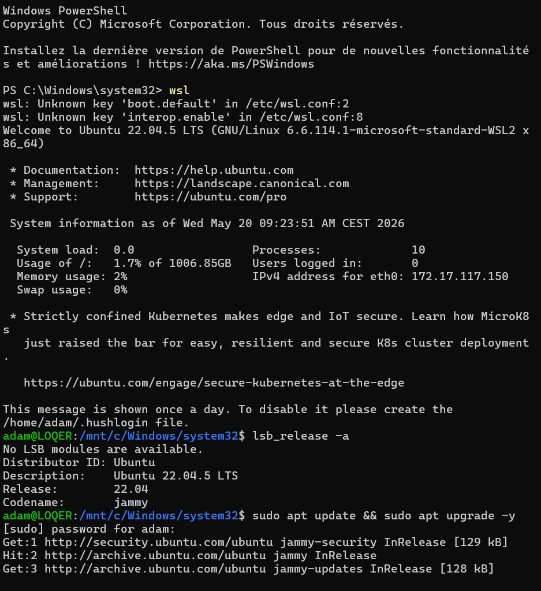

> - `apt install locales` — installs the `locales` package, which provides locale configuration tools.
> - `locale-gen` — generates the actual locale data files on disk:
>   - `en_US` — basic American English.
>   - `en_US.UTF-8` — American English with full Unicode support  (what ROS2 needs).
> - `update-locale` — writes the settings to `/etc/default/locale`, making them **persistent** across reboots.
> - `LC_ALL` — stands for **L**ocale **C**ategory **ALL**. Overrides all locale categories at once (date format, number format, messages, etc.).
> - `LANG` — stands for **LANG**uage. Sets the system default language.
> - `export` — makes the variable active in the **current terminal session immediately**, without rebooting.

Verify:

```bash
locale
```

> Run again — you should now see `UTF-8` on every line.


##  Step 3 — Add the ROS2 Repository

> A **repository** (or **repo**) is an online server hosting software packages. Ubuntu only knows its own repos by default — we need to add the official ROS2 repo so `apt` can find ROS2 packages.

### Install required tools

```bash
sudo apt install software-properties-common curl gnupg lsb-release -y
```

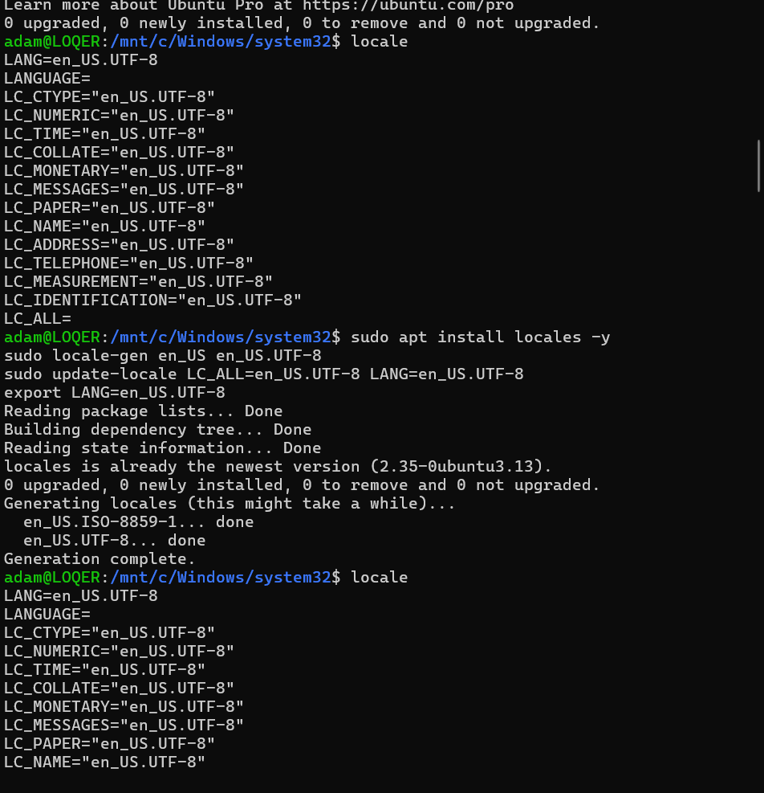

> - `software-properties-common` — provides the `add-apt-repository` command to manage apt sources.
> - `curl` — stands for **C**lient **URL**. Downloads files from the internet via command line (HTTP, HTTPS, FTP, etc.).
> - `gnupg` — stands for **GNU P**rivacy **G**uard. Handles encryption and digital signatures — used to verify package authenticity.
> - `lsb-release` — provides `lsb_release`, used to detect your Ubuntu version automatically in scripts.

### Add the ROS2 GPG key

> A **GPG key** is a cryptographic key used to **verify** that packages come from a trusted source and haven't been tampered with. **GPG** = **G**NU **P**rivacy **G**uard.

```bash
sudo curl -sSL https://raw.githubusercontent.com/ros/rosdistro/master/ros.key \
-o /usr/share/keyrings/ros-archive-keyring.gpg
```

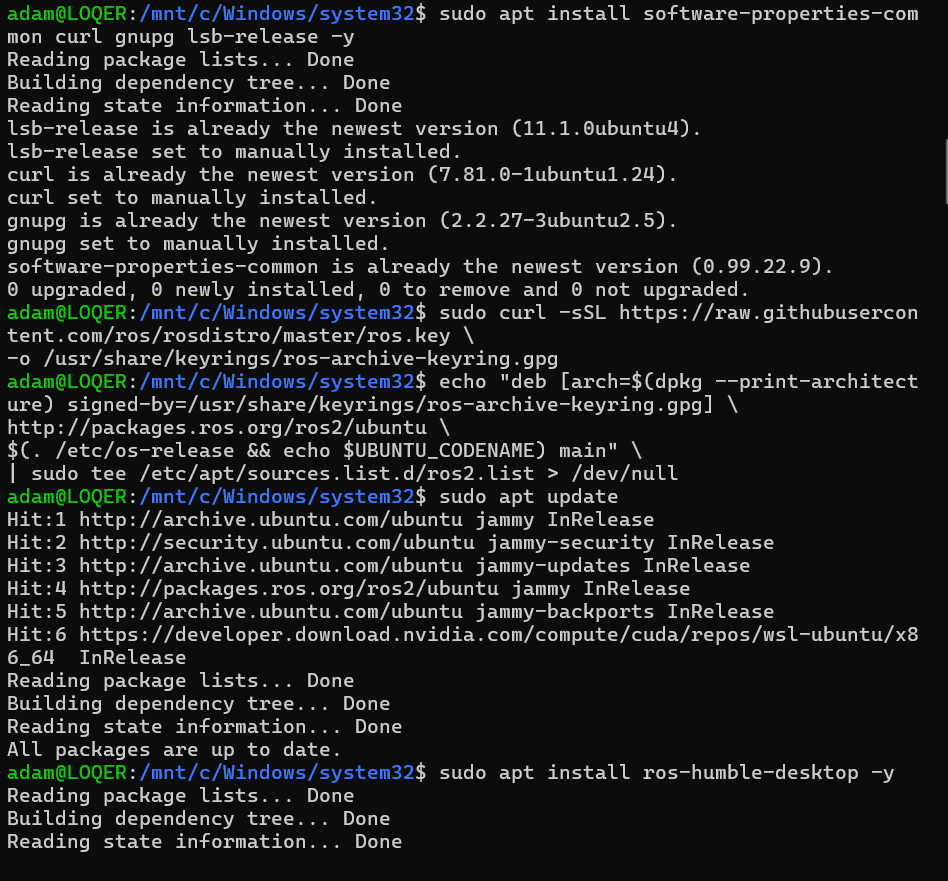

> - `-s` — **silent**: hides the download progress bar.
> - `-S` — **show-error**: still shows errors even in silent mode. (`-sSL` = quiet but not blind).
> - `-L` — **location**: follows HTTP redirects automatically if the URL moved.
> - `https://raw.githubusercontent.com/...` — the official ROS GPG key on GitHub. `raw.githubusercontent.com` serves raw file content (not the HTML webpage).
> - `-o` — **output**: saves the file to a path instead of printing it.
> - `/usr/share/keyrings/` — standard Linux directory for trusted apt signing keys.
> - `.gpg` — file extension for a GPG key file.
> - `\` — **line continuation**: the command continues on the next line (purely for readability).

### Add the repository

```bash
echo "deb [arch=$(dpkg --print-architecture) signed-by=/usr/share/keyrings/ros-archive-keyring.gpg] \
http://packages.ros.org/ros2/ubuntu \
$(. /etc/os-release && echo $UBUNTU_CODENAME) main" \
| sudo tee /etc/apt/sources.list.d/ros2.list > /dev/null
```

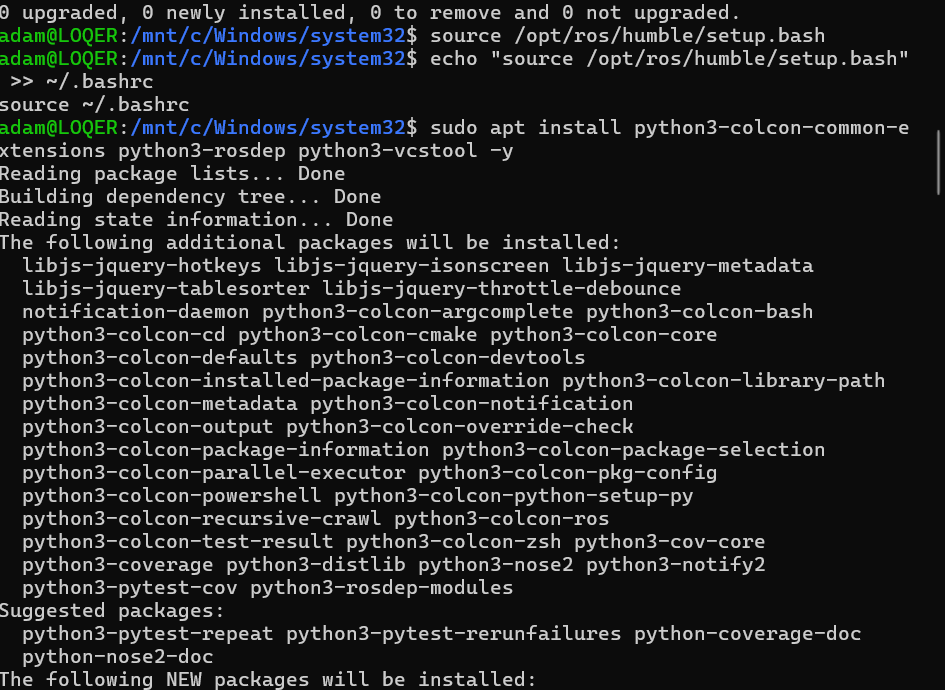

> - `echo "deb [...]"` — prints the apt source line as text.
> - `deb` — stands for **Deb**ian package. Tells apt this is a binary package source.
> - `arch=$(dpkg --print-architecture)` — **command substitution** `$(...)`: runs the inner command and inserts its output. `dpkg` = **D**ebian **P**ac**k**a**g**e manager. Returns your CPU architecture: `amd64` (64-bit Intel/AMD), `arm64` (Raspberry Pi 4), etc.
> - `signed-by=...` — tells apt to verify packages with our GPG key. A security measure.
> - `$(. /etc/os-release && echo $UBUNTU_CODENAME)` — loads the OS info file and extracts `jammy` (Ubuntu 22.04's codename). Makes the command portable across Ubuntu versions.
> - `main` — the primary, fully-supported section of the ROS2 repo.
> - `|` — **pipe operator**: takes the output of the left command and feeds it as input to the right command.
> - `sudo tee /etc/apt/sources.list.d/ros2.list` — `tee` writes to a file **and** stdout simultaneously. We use `tee` with `sudo` because writing to `/etc/apt/sources.list.d/` needs root. A plain `sudo echo ... > file` won't work — the shell handles `>` before `sudo` applies.
> - `> /dev/null` — discards the terminal output. `/dev/null` is a special Linux "black hole" file that throws away everything written to it.


##  Step 4 — Update Package Index

```bash
sudo apt update
```

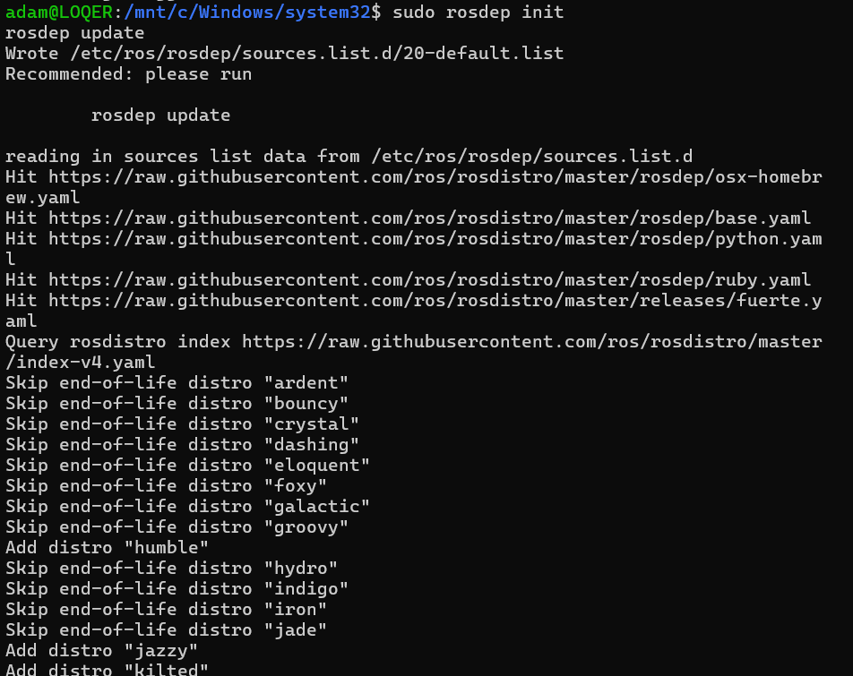

> Now that the ROS2 repo is added, this makes `apt` aware of all `ros-humble-*` packages. Without this step, `apt` wouldn't know they exist.


##  Step 5 — Install ROS2 Humble

```bash
sudo apt install ros-humble-desktop -y
```

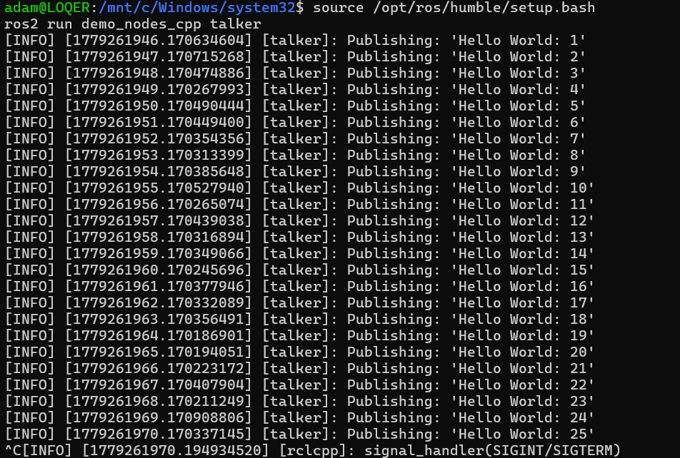

> Installs the **complete** ROS2 Humble environment, including:
>
> - **RViz2** — **R**OS **Vi**suali**z**ation **2**: a 3D GUI tool to display robot sensors, transforms, maps, and more.
> - **Gazebo support** — bridge packages connecting Gazebo physics simulator to ROS2.
> - **Navigation (Nav2)** — path planning and obstacle avoidance stack.
> - **Demo nodes** — ready-to-run example programs (talker, listener) to test your setup.
> - **rqt tools** — GUI plugin framework for ROS2.
>
> The package naming pattern is `ros-<distro>-<package>`. `humble` is the ROS2 **distribution** name (like a version). ROS distributions are named after sea turtles  — Humble Hawksbill, Foxy Fitzroy, Iron Irwini, etc.


## ️ Step 6 — Source the ROS2 Environment

> **Sourcing** a file means executing it **inside** your current shell, so all the variables and paths it defines become active immediately. ROS2 installs to `/opt/ros/humble/` which your shell doesn't know about by default.

Temporary (current terminal only):

```bash
source /opt/ros/humble/setup.bash
```

> - `source` — executes the script in the **current shell** (not a subprocess). Critical: if you used `bash setup.bash` instead, the variables would live in a child process and disappear when it exits.
> - `/opt/ros/humble/setup.bash` — auto-generated by ROS2. Exports all necessary paths: `PATH`, `AMENT_PREFIX_PATH`, `PYTHONPATH`, etc.
> - `/opt/` — stands for **opt**ional. The standard Linux directory for third-party software not part of the OS core.

Permanent (every new terminal automatically):

```bash
echo "source /opt/ros/humble/setup.bash" >> ~/.bashrc
source ~/.bashrc
```


##  Step 7 — Install Development Tools

```bash
sudo apt install python3-colcon-common-extensions python3-rosdep python3-vcstool -y
```

> - `python3-colcon-common-extensions` — **colcon** = **COL**lective **CON**struction. The build system to compile ROS2 packages. `common-extensions` adds standard plugins (parallel builds, symlink install, etc.).
> - `python3-rosdep` — **rosdep** = **ROS** **DEP**endency manager. Automatically resolves and installs system dependencies declared in a package's `package.xml`.
> - `python3-vcstool` — **vcs** = **V**ersion **C**ontrol **S**ystem tool. Clones multiple git repositories at once from a `.repos` file. Essential for large multi-package workspaces.


##  Step 8 — Initialize rosdep

```bash
sudo rosdep init
rosdep update
```

> - `sudo rosdep init` — initializes rosdep by creating `/etc/ros/rosdep/sources.list.d/` with default source files. Run **once** with sudo. If you see "file already exists" → already initialized, no problem.
> - `rosdep update` — downloads the latest dependency databases from the internet. Run **without sudo** — running as root causes permission issues that break rosdep later. Re-run periodically to stay up to date.


##  Step 9 — Test the Installation

We use the classic **pub/sub** (**pub**lish/**sub**scribe) demo to verify ROS2's communication middleware is working.

> **DDS** — stands for **D**ata **D**istribution **S**ervice. The communication protocol underneath ROS2. Unlike ROS1 (which had a central **master** process), ROS2's DDS is fully **decentralized** — nodes find each other automatically on the network (peer-to-peer).

**Terminal 1 — Talker (sender):**

```bash
source /opt/ros/humble/setup.bash
ros2 run demo_nodes_cpp talker
```

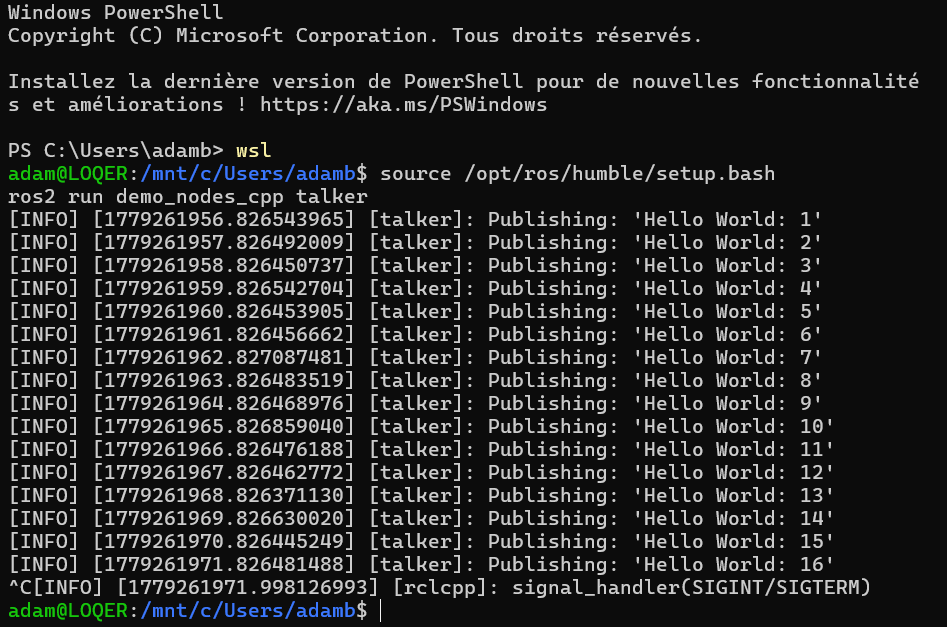

> - `ros2 run` — the **CLI** (**C**ommand **L**ine **I**nterface) command to run a node from a package.
> - `demo_nodes_cpp` — a C++ demo package. `cpp` = **C**++ (**C** **P**lus **P**lus).
> - `talker` — **publishes** (sends) `"Hello World: X"` messages on the `/chatter` topic.

**Terminal 2 — Listener (receiver):**

```bash
source /opt/ros/humble/setup.bash
ros2 run demo_nodes_py listener
```

> - `demo_nodes_py` — same demo but in Python. `py` = **Py**thon.
> - `listener` — **subscribes** to the `/chatter` topic and prints every message it receives.

 If Terminal 2 prints `[INFO] I heard: Hello World: 1, 2, 3...` → **ROS2 is fully working.**


##  Step 10 — Create a ROS2 Workspace

> A **workspace** is a directory structure where you organize, build, and run your ROS2 packages. Think of it as your project root folder.

```bash
mkdir -p ~/ros2_ws/src
cd ~/ros2_ws
```

> - `mkdir` — stands for **M**a**k**e **Dir**ectory. Creates a new folder.
> - `-p` — stands for **p**arents. Creates all intermediate folders in the path if they don't exist yet. Without it, `mkdir ~/ros2_ws/src` would fail if `ros2_ws` doesn't exist yet.
> - `~/ros2_ws/src` — the conventional workspace structure. `src` = **source**: where your package code lives.
> - `cd` — stands for **C**hange **D**irectory. Moves your current location to the specified path.

```bash
colcon build
```

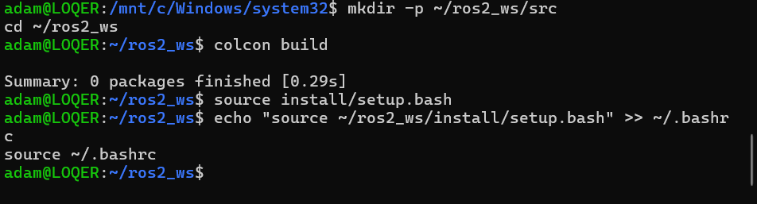

> Builds all packages found in `src/`. colcon auto-detects Python (`ament_python`) and C++ (`ament_cmake`) packages.
>
> - **ament** — ROS2's build framework, wrapping CMake and Python's setuptools.
> - **cmake** — stands for **C**ross-platform **M**ake. A widely used C/C++ build system generator.

```bash
source install/setup.bash
```

> After building, colcon generates `install/setup.bash`. Sourcing it **overlays** your workspace on top of the base ROS2 install, making your custom packages available.
>
> - **overlay** — ROS2 workspaces stack on top of each other. Your workspace takes priority over the base install when there's a name conflict.

Make it permanent:

```bash
echo "source ~/ros2_ws/install/setup.bash" >> ~/.bashrc
source ~/.bashrc
```


##  Workspace Structure

```
ros2_ws/
 ├── build/      ← Intermediate build files (object files, CMake cache...)
 ├── install/    ← Final output (executables, libraries, setup scripts)
 ├── log/        ← Build logs for debugging colcon issues
 └── src/        ← YOUR CODE LIVES HERE (.py, .cpp, package.xml...)
```

> ️ These 4 folders are **auto-generated** by `colcon build`. Only ever manually work inside `src/`. Never edit `build/` or `install/` — they get fully regenerated on every build.


##  Create Your First Package

```bash
cd ~/ros2_ws/src

ros2 pkg create my_robot_pkg --build-type ament_python --dependencies rclpy
```

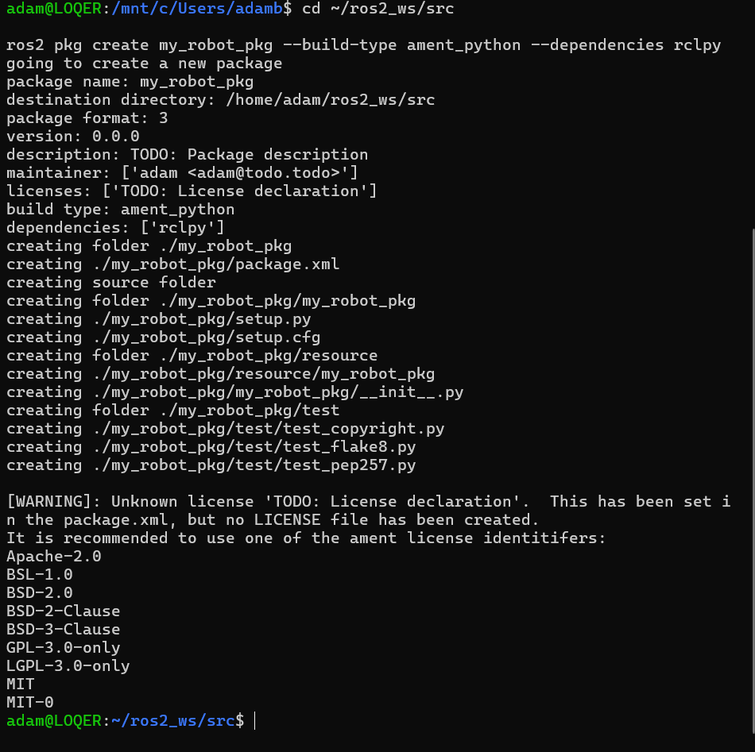

> - `ros2 pkg create` — scaffolds (auto-generates) a new package with all required files.
> - `my_robot_pkg` — your package name. Convention: use `snake_case` (lowercase + underscores).
> - `--build-type ament_python` — this is a Python package. Use `ament_cmake` for C++.
> - `--dependencies rclpy` — adds `rclpy` as a dependency in `package.xml` and `setup.py`.
>   - `rclpy` — **R**OS **C**lient **L**ibrary for **Py**thon. The Python API to write ROS2 nodes. The C++ equivalent is `rclcpp`.
>   - `package.xml` — the manifest: describes your package (name, version, author, dependencies).
>   - `setup.py` — the Python build script: tells colcon how to install your package and its entry points.

```bash
cd ~/ros2_ws
colcon build
```

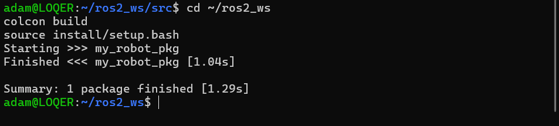

```bash
source install/setup.bash
```


##  Optional — Install Gazebo Simulator

Gazebo is the most popular 3D simulator for ROS2.

```bash
sudo apt install gazebo ros-humble-gazebo-ros-pkgs -y
```

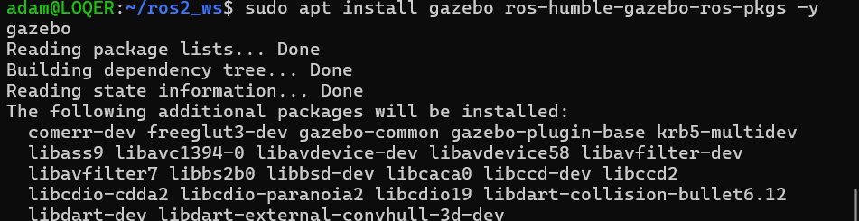
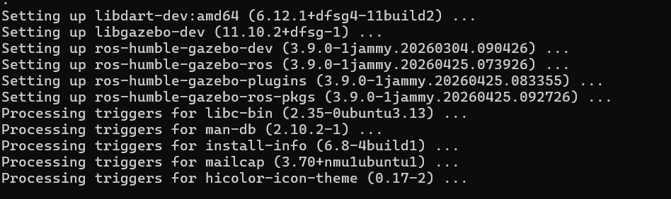

To test it:
```bash
gazebo
```

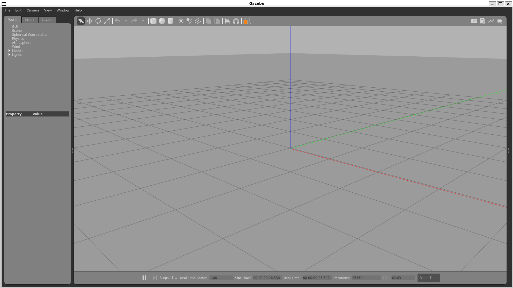


## ️ Advanced Tools & Maintenance

### 🩺 System Check with ROS2 Doctor
To verify your system health:
```bash
ros2 doctor
```
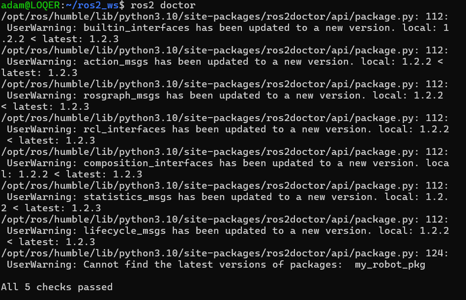

###  Clean Build
If you encounter weird build errors, try cleaning your workspace:
```bash
rm -rf build install log
colcon build
```
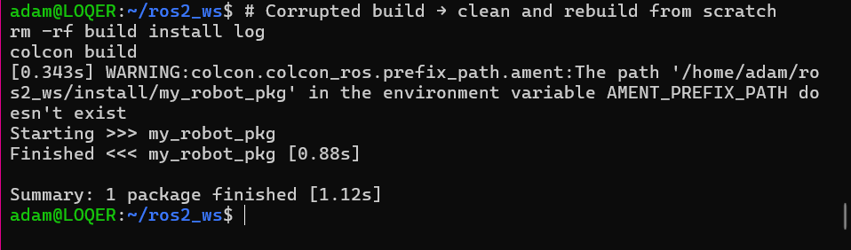

###  Dependency Management
To automatically install missing dependencies for your workspace:
```bash
rosdep install --from-paths src --ignore-src -r -y
```
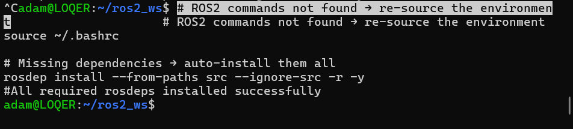


##  Core Concepts Visualized

### The Pub/Sub Model

```
┌─────────────────────────────────────────────────────────┐
│                      ROS2 NETWORK                       │
│                                                         │
│   ┌──────────────┐                ┌──────────────────┐   │
│   │   Talker     │                │    Listener      │   │
│   │   (C++ node) │                │  (Python node)   │   │
│   │              │                │                  │   │
│   │  PUBLISHER   │──/chatter ──▶  │   SUBSCRIBER     │   │
│   │              │  "Hello: 1"    │                  │   │
│   │              │  "Hello: 2"    │  callback() runs │   │
│   │              │  "Hello: 3"    │  → prints msg    │   │
│   └──────────────┘                └──────────────────┘   │
│                                                          │
└─────────────────────────────────────────────────────────┘
```

> The two nodes **never directly communicate** — they only know about the `/chatter` topic. This decoupling is what makes ROS2 so powerful and modular.


##  How ROS2 Generally Works — The Big Picture

```
                        YOUR ROBOT SYSTEM
   ┌────────────────────────────────────────────────────────┐
   │                                                        │
   │  [Sensor Nodes]        [Processing Nodes]              │
   │  camera_node  ──/img──▶ vision_node                    │
   │  lidar_node   ──/scan─▶ slam_node  ──/map──▶ nav_node  │
   │  imu_node     ──/imu──▶ slam_node                      │
   │                                         │              │
   │                                     /cmd_vel           │
   │                                         │              │
   │  [Actuator Nodes]                       ▼              │
   │  motor_node  ◀──/cmd_vel───────── nav_node             │
   │                                                        │
   └────────────────────────────────────────────────────────┘

   All nodes communicate via topics through the DDS middleware
   Each arrow (──▶) = one topic (publish → subscribe)
```

> - **IMU** — stands for **I**nertial **M**easurement **U**nit. A sensor that measures acceleration and rotation.
> - **`/cmd_vel`** — stands for **com**man**d** **vel**ocity. The standard ROS2 topic for sending movement commands (linear speed + angular rotation) to a robot base.
> - **`/odom`** — stands for **odom**etry. The topic publishing the robot's estimated position over time.
> - **`/scan`** — the standard topic for LiDAR distance scan data.
> - **`/map`** — the topic publishing the occupancy grid map built by SLAM.


##  Other Communication Patterns in ROS2

Topics are the most common, but ROS2 has two other patterns:

| Pattern | How it works | Use case |
|---|---|---|
| **Topic** (pub/sub) | Continuous stream, any number of senders/receivers | Sensor data, robot state |
| **Service** (req/res) | One node requests, one node responds, then done | Turn a camera on/off, get a single value |
| **Action** | Like a service but with progress feedback + cancelable | Navigate to a goal (takes time, can be cancelled) |


## ️ Key ROS2 Vocabulary — Quick Reference

| Term | Meaning |
|---|---|
| **Node** | One independent running program |
| **Topic** | Named channel for continuous data exchange |
| **Publisher** | Node that sends data on a topic |
| **Subscriber** | Node that receives data from a topic |
| **Message** | The data unit exchanged on a topic (e.g. `String`, `Image`, `LaserScan`) |
| **Callback** | Function automatically called when a message arrives |
| **Package** | A folder grouping related nodes, configs, and launch files |
| **Workspace** | The root folder where you build and run your packages |
| **Launch file** | A script that starts multiple nodes at once with configuration |
| **DDS** | The underlying peer-to-peer communication middleware |
| **QoS** | Quality of Service — settings for reliability, durability of message delivery |
| **TF** | Transform — the system tracking coordinate frames of every robot part |


>  **ROS2 motto**: *"One node = one responsibility"*. Build small, focused nodes and connect them through topics. This makes your robot system **modular**, **testable**, and **robust**.

*Guide written By BENJABBAR ADAM . Last updated: 27 May 2026.*
